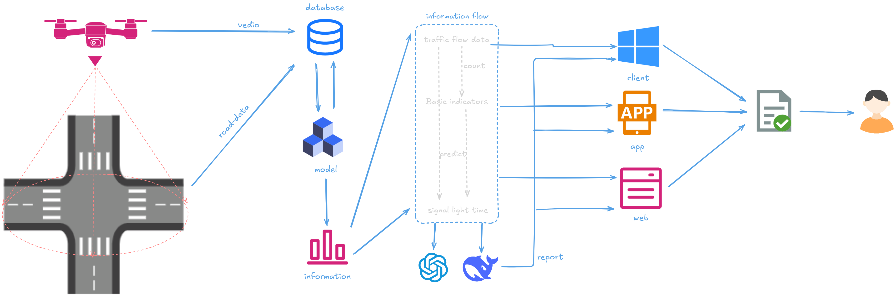
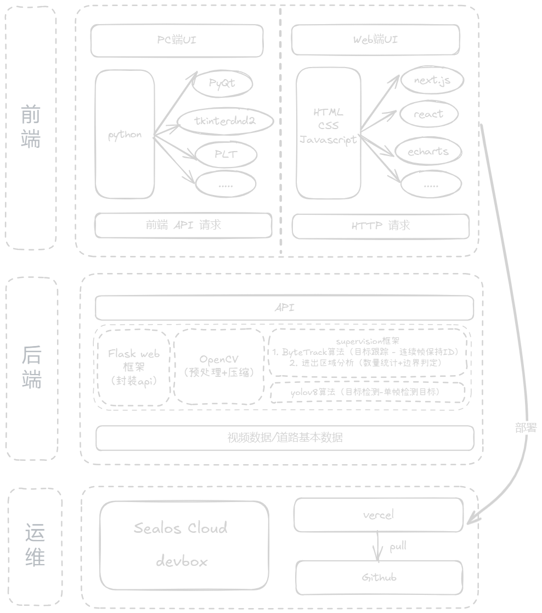

### 项目构想

---

### 技术实现

---

### 演示数据集下载地址
- https://drive.google.com/uc?id=1qadBd7lgpediafCpL_yedGjQPk-FLK-W

---

### 模型权重下载地址
- https://drive.google.com/uc?id=1y-IfToCjRXa3ZdC1JpnKRopC7mcQW-5z

---

### 注释：
项目目前属于开发阶段，目前仅包含核心功能实现

